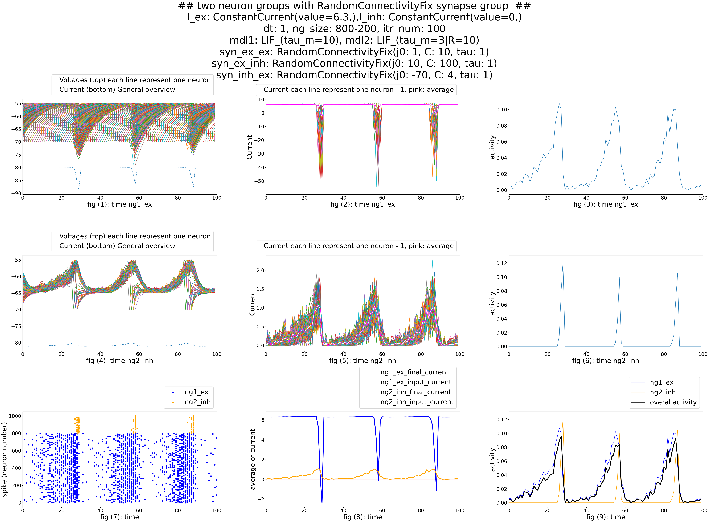

# Computational Neuroscience - Synapse and Neuron Population Dynamics

## Project Overview

In this project, we delved into the intricate dynamics governing synapses and neuron populations to simulate and gain insights into their behavior under varying stimuli. The project encompassed several tasks, each focusing on distinct aspects of synaptic functionality, neuronal interactions, and decision-making processes in response to stimuli.

## Project Objectives

1. **Understanding Synapse Functionality:** Our primary goal was to investigate and understand the operational mechanisms of synapses in neural communication.

2. **Exploring Neuronal Population Dynamics:** We aimed to explore how different neuron populations interact and influence cognitive processes such as learning and memory.

3. **Simulating Decision-Making Processes:** Another crucial aspect was modeling and analyzing decision-making processes under the influence of diverse stimuli.

## Activities

### Task 1: Synapse Functionality

- **Implementing Delta Function:** We implemented the Dirac delta function using various synaptic mechanisms to observe their effects.

- **Comparing Synapse Types:** We conducted experiments to compare the performance of different synapse types based on their dynamic conductivities between neurons. This involved measuring resultant currents and sensitivity to noise in each connection model.

One neuron group with an inner synapse group:

Two neuron groups with a fully connected synapse group from first group to second group:

### Task 2: Neuron Models

- **Building Neuronal Population Models:** Using established neuron models, we constructed two types of populations:
  
  1. **Homogeneous Neuronal Population:** Consisting of 80% excitatory and 20% inhibitory neurons.  result:

  
  2. **Heterogeneous Neuronal Population:** With the same composition ratio of excitatory and inhibitory neurons.

- **Simulating and Visualizing:** We simulated neuron activities by applying random input currents and visualized their behavior over time using raster plots. Additionally, we plotted overall population activity and analyzed how different parameter sets and inter-neuron connection patterns affected their dynamics.

### Task 3: Two Excitatory and One Inhibitory Neuron Population

- **Constructing Neural Networks:** We built networks comprising two excitatory neuron populations and one inhibitory neuron population, establishing interconnections among them.

- **Simulating and Visualizing:** For each excitatory population, we simulated scenarios with varying input currents, ensuring differential strengths during each run. We depicted their activities through raster plots and visualized the collective behavior of all three populations.

- **Analyzing Membrane Potential Distribution:** We analyzed and plotted the distribution of membrane potentials throughout the simulation runs, examining how it influenced neuronal behaviors.

- **Repetition and Analysis:** We repeated experiments with different parameters and connection patterns to validate results and provide comprehensive analyses of neuron population behaviors.

For project reports or further inquiries, please reach out to me at [amiraliamini@ur.ac.ir 📨](mailto:amiraliamini@ur.ac.ir).
